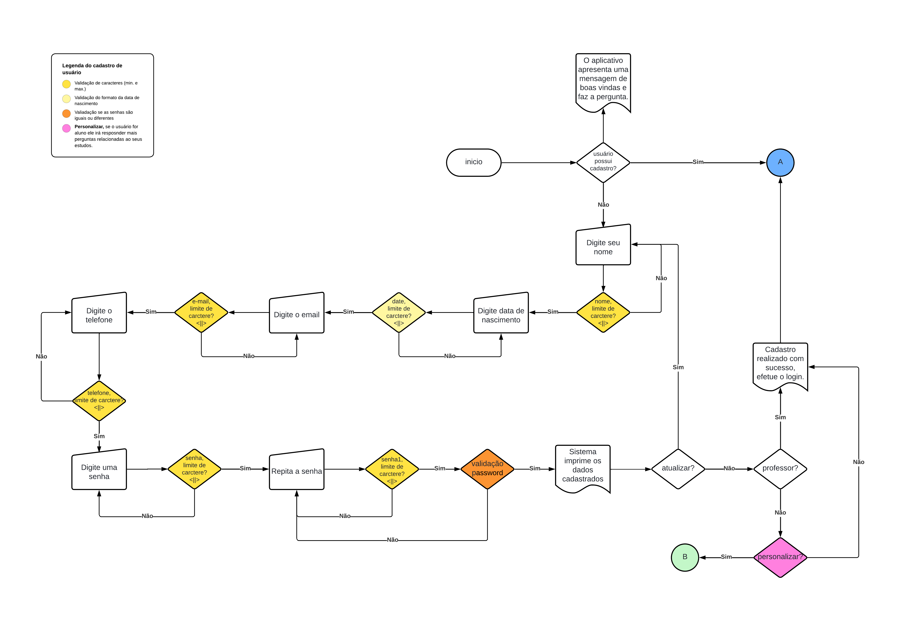

 # Max Study

 ## Resumo do projeto
 O objetivo maior deste projeto é oferecer um espaço de estudos em que o discente possa utilizar de acordo com a sua rotina fora da sala de aula. Não se trata apenas de uma aplicação de estudos, mas sim de uma aplicação que mostra os caminhos necessários para um estudo eficiente e que, principalmente, ofereça uma recompensa.


 ## Índices 
 - <a href="#funcionalidades-do-projeto"> Funcionalidades do Projeto</a>
 - <a href="#funções">Funções</a>
 - <a href="#como-são-usadas-as-funções">Como são usadas as funções</a>
 - <a href="#txt">TXT</a>
 - <a href="#fluxogramas"> Fluxogramas</a>
 - <a href="#autor-do-projeto"> Autor do projeto</a>
 - <a href="#futuras-realeses"> Futuras realeses</a>


 ## Funcionalidades do projeto:

 - [x] Cadastro do usuário
 - [x] Cadastro personalizado
 - [x] Login
 - [x] Área de estudos
 - [x] Recomendação de estudos
 - [x] Tempo de estudo personalizado


 ## Funções
 ```bash

    respostas = {
        'sim': True,
        'não': False,
        's': True,
        'n': False,
        'nao': False
    } #Dicionário simples para a validação de respostas nas funções de perguntas.
  

    def menu_perguntas(pergunta): 
    #função função de perguntas, como parâmetro a variável 'pergunta'
        os.system("cls") # utilizado para limpar o terminal a cada nova execução
        while True: #laço de repetição infinito até que a resposta seja validada
            print(pergunta)
            resposta = input("Digite sua resposta: ").strip().lower() #está sendo utlizado dos métodos neste input que são: .strip() que remove os espaços em brancos e o lower() que converte textos em letras minúsculas. 

            if resposta in respostas:
            #estrutura de condição que compara as resposta do input com o dicionário. Se a resposta estiver dentro da condição da biblioteca, a resposta é validada.
                return respostas[resposta]
            else:
                print("Resposta inválida. Por favor, digite 'SIM/NÃO ou S/N':")
        #caso a resposta esteja fora da validação, o programa mostra o erro para o usuário e pede para o usuário digitar novamente até que a resposta esteja dentro da condição do dicionário.
 ``` 
 ```bash
    def menu_opcoes(pergunta, opcoes):
    #função para exibir para o usuário as perguntas com opções enumeradas
    os.system("cls")
    while True:
        print(pergunta)
        for i, opcao in enumerate(opcoes, start=1):
            print(f"{i}. {opcao}")
        #laço de repetição FOR recebe como contado I, OPCAO também vai armazenar o indice do elemento OPCOES, start=1 é para cada elemento da lista começar em 1 e não por 0 que é o padrão das listas 
        escolha = input("Digite o número da opção: ")
        try: #laço de validação de erros  
            escolha = int(escolha)
            if 1 <= escolha <= len(opcoes): #estrutura de condição que a escolha não pode ser menor que 0 e nem maior que a quantidade de opções que existe na lista OPCOES
                return opcoes[escolha - 1] #regra do índice se a resposta for válida é subtraída por -1 para se adaptar ao índice  
            else:
                print("Opção inválida. Tente novamente.") 
        except ValueError:
            print("Entrada inválida. Digite um número.") # se o usuário digitar uma entrada diferente de um número inteiro.

 ```
 ```bash
    def registrar_horarios():
    os.system("cls")  #função para registrar os horários

    horarios = {} #variável horarios como um dicionário vazio que vai armazenar os dados
    dias_semana = ['Segunda', 'Terça', 'Quarta', 'Quinta', 'Sexta', 'Sábado', 'Domingo']
    #variável como uma lista que será utiliza para imprimir para o usuário cada dia semana
    for dia in dias_semana:
        while True: #laço de repetição que vai percorrer a variável dias_semana
            horario = input(f"Quanto tempo livre você tem no(a) {dia} (HH:MM): ")
            #horário é avariável que vai armazernar a resposta do usuário
            #{dia} é um dicionário que foi armazenado os dias da semana que vai ser impresso para o usuário 
            try:
                hora, minuto = map(int, horario.split(':'))
                # hora e monutos são entradas do usuário que vai ser convertida para inteiro por meio do método MAP e split vai ser estes dois elementos com ':'
                if 0 <= hora <= 23 and 0 <= minuto <= 59:
                    break
                #estrutura de condição de hora e minuto no formato 23:59
                else:
                    print("Hora ou minuto inválido.")
            except ValueError:
                print("Formato de hora inválido. Use HH:MM.")

        horarios[dia] = f"{hora:02d}:{minuto:02d}" 
        #variável horarios que armazena em uma lista o dicionário 'dia' que é convertido no formato HH:MM 

    with open('respostas_dias_semana.txt', 'w', encoding='utf-8') as arquivo:
        for dia, horario in horarios.items():
        #dia e horário são variáveis que recebem o valor de cada item do dicionário 
            arquivo.write(f"{dia}: {horario}\n")
            #armazena o dia e o horário
    #arquivo txt que armazena as resposta da função dias_semana

 ```

 ### Como são usadas as funções  
 ```bash
     resposta = menu_perguntas(estuda)
    print("Sua resposta:", resposta)
    print("")

    if (resposta == True):  # No laço de decisão são chamadas as funções com as perguntas e respostas

        resposta1 = menu_perguntas(reprovou)
        print("Sua resposta:", resposta1)
        print("")

        while True:
            if (resposta1 == True): 
                menu_opcoes(responda, opcoes1)
                print("")
                resposta3 = menu_perguntas(estuda_casa)
                print("Sua resposta:", resposta3)
                print("")

                while True:
                    if (resposta3 == True):
                        registrar_horarios()
                        media_disciplinas_exa()

                        media_disciplinas_huma()
                        menu_opcoes(dispositivo, opcoes3)
                        print("")

                        resposta21 = menu_perguntas_int(compartilha_disp)
                        print("Sua resposta:", resposta21)
                        print("")

                        resposta22 = menu_perguntas(internet)
                        print("Sua resposta:", resposta22)
                        print("")


 ```

 ## TXT

 ```bash
        
    def calcular_mediana_horarios(caminho_txt): #função para extrair os dados do txt semanas_dias
        horarios = [] #variável horários com uma lista vázia
        with open(caminho_txt, "r") as arquivo: #inicio do txt
            for linha in arquivo:
            #variável 'linha' vai percorrer por todo o 'arquivo'
                horario = linha.strip()
                #variável horário armazena os elementos de 'linha' e strip é para remover os espaços em branco no inicio e final de uma string
                horarios.append(horario)
                #chama a minha lista 'horarios' que será armazanada os elementos de 'horário', append acrescenta um novo elemento no final de cada lista
                horarios.sort()
                #método sort() organiza os elementos da lista 'horários' na ordem ascendente 
        meio = len(horarios) // 2
        #se o número for impa será divido por 2, len cálcula cada elemento da lista 'horário'
        if len(horarios) % 2 == 1:
            mediana = horarios[meio] 
        else:
            mediana = (horarios[meio - 1] + horarios[meio]) / 2
            # se o número for par, ele acessa o elemento antes do meio, depois acessa o elemento do meio e faz a soma dos dois que é divido por dois.
        return mediana


    caminho_do_arquivo = r"C:\\Users\\breno\\OneDrive\\Documentos\\PROJETOS 1° PERIODO\\APP AULA atualizado\\respostas_dias_semana.txt"
    mediana = calcular_mediana_horarios(caminho_do_arquivo)
    print("\nDe acordo com sua resposta no cadastro, obteve-se o seguinte resultado.")
    print(f"\nO tempo médio que você deve estudar todos os dias: {mediana}")
    print("\n\nAGUARDE! VOCÊ SERÁ REDIRECIONADO...\n\n")
    time.sleep(10)


 ```
 ```bash
        def med_exatas(caminho_txt1): #função para extrair os dados do txt de médias de exatas
        os.system("cls")
        notas = []
        with codecs.open(caminho_txt1, 'r', encoding='utf-8') as arquivo1:
            for linha in arquivo1:
                disciplina, nota_exa = linha.strip().split(': ')
                #as variáveis 'disciplina' e 'nota_exa' irão armazenar os elementos de 'linha' 
                nota = float(nota_exa)
                #variável 'nota' irá armazenar os elementos de números inteiros ou decimais da variável nota_exa
                notas.append((disciplina, nota))
                #a lista 'notas' irá armazenar os elementos 'disciplina' e 'nota'

        media_exatas = sum(nota for _, nota in notas) / len(notas)
        #aqui será feita a média aritmética por que está sendo armazenada na variável 'media_exa' 
        #nota for_, que dizer que o primeiro elemento será disconsiderado e a nota será considerada no cálculo, len calcula todos elementos de 'notas' que é dividido pela quanidade de elementos.
        media_arredondada = round(media_exatas, 1)
        # variável que vai armazanar os elementos de media_exa. round é reponsável por fazer o arredondamento núméricos e 1 que dizer que só vai ter uma casa dicimal após a vírgula.
        print("\nNotas:")
        for disciplina, nota in notas:
            print(f"{disciplina}: {nota}")
        print(f"\nMédia das notas: {media_arredondada}")
        return media_exatas


    caminho_txt1 = r"C:\\Users\\breno\\OneDrive\\Documentos\\PROJETOS 1° PERIODO\\APP AULA atualizado\\respostas_media_exa.txt"
    media_exatas = med_exatas(caminho_txt1)
    print(f"A média final é: {media_exatas}")
 
 ```

 ## Fluxogramas 

 

 

 

 ## Autor do projeto
 ### Breno Ramos da Silva 
 ### Sistemas de Informação
 ### Universidade Federal Rural de Pernambuco-UFRPE - SEDE
  


 
 
 ## Futuras realeses 
 - [ ] Inserir o delete no cadastro
 - [ ] Adicionar o programas de pontos
 - [ ] Área de trocar de pontos
 - [ ] Fórum 